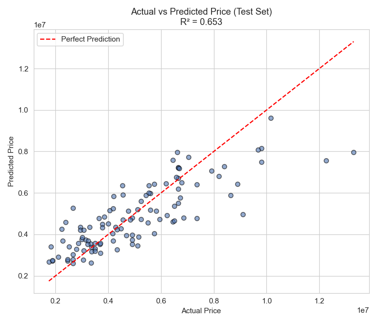
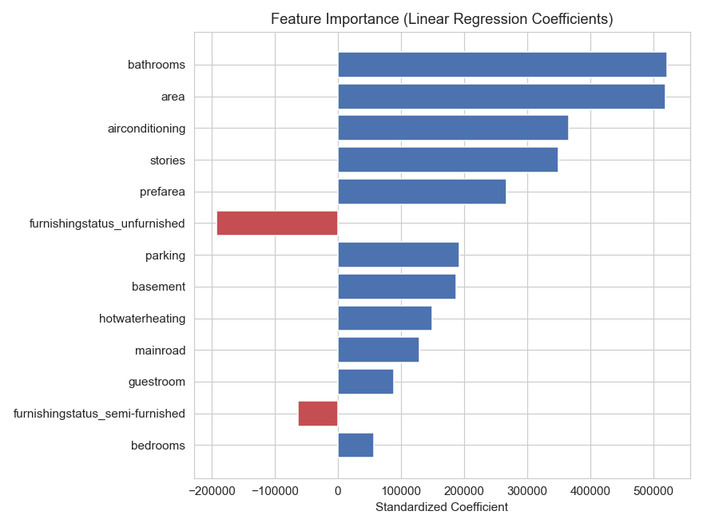

# 🏠 Housing Price Prediction — Linear Regression

Predicting house prices from structural and amenity features using linear regression. This project walks through the full applied machine learning workflow: data exploration, cleaning, feature selection, model training, evaluation, and visualization.

## 📊 Overview

- **Dataset:** 545 housing records with 12 features (area, bedrooms, bathrooms, stories, parking, furnishing status, amenities, etc.)
- **Target variable:** `price`
- **Model:** Ordinary Least Squares Linear Regression (scikit-learn)
- **Test R²:** 0.653
- **Test RMSE:** ₹1,324,507

## 📁 Project Structure

```
housing-price-prediction/
│
├── data/
│   └── Housing.csv                  # raw dataset
│
├── outputs/
│   ├── cleaned_housing.csv          # cleaned/encoded dataset
│   ├── coefficients.csv             # feature coefficients
│   ├── metrics.txt                  # R², MSE, RMSE, MAE
│   └── plots/
│       ├── 01_correlation_heatmap.png
│       ├── 02_actual_vs_predicted.png
│       ├── 03_residual_plot.png
│       ├── 04_residual_distribution.png
│       └── 05_feature_importance.png
│
├── housing_regression.py            # main pipeline script
├── requirements.txt
└── README.md
```

## ⚙️ Workflow

1. **Data Exploration & Cleaning** — checked for missing values and duplicates (none found); encoded binary yes/no columns and one-hot encoded `furnishingstatus`.
2. **Feature Selection** — used Pearson correlation to identify the strongest predictors of price (area, bathrooms, air conditioning, stories).
3. **Model Training** — 80/20 train/test split, features standardized with `StandardScaler`, fit with `LinearRegression`.
4. **Model Evaluation** — measured performance with R², MSE, RMSE, and MAE on the held-out test set.
5. **Visualization** — correlation heatmap, actual vs. predicted scatter plot, residual plots, and feature importance chart.

## 📈 Results

| Metric | Value |
|---|---|
| Training R² | 0.686 |
| Test R² | 0.653 |
| Test MSE | ₹1,754,318,687,331 |
| Test RMSE | ₹1,324,507 |
| Test MAE | ₹970,043 |

**Top price drivers** (by standardized coefficient): bathrooms, area, air conditioning, number of stories, and preferred area location. Unfurnished homes show the strongest negative effect on price.

### Actual vs. Predicted Prices


### Feature Importance


## 🚀 Getting Started

### Prerequisites
```bash
pip install -r requirements.txt
```

### Run the pipeline
```bash
python housing_regression.py
```

This will print exploration/evaluation results to the console and save cleaned data, metrics, coefficients, and plots to the `outputs/` folder.

## 🛠️ Built With
- [pandas](https://pandas.pydata.org/) — data manipulation
- [scikit-learn](https://scikit-learn.org/) — modeling and evaluation
- [matplotlib](https://matplotlib.org/) & [seaborn](https://seaborn.pydata.org/) — visualization

## 🔮 Future Improvements
- Log-transform the target variable to address heteroscedasticity at higher price points
- Try non-linear models (Random Forest, Gradient Boosting) for comparison
- Add cross-validation for more robust performance estimates
- Hyperparameter tuning and regularization (Ridge/Lasso) to reduce overfitting risk

